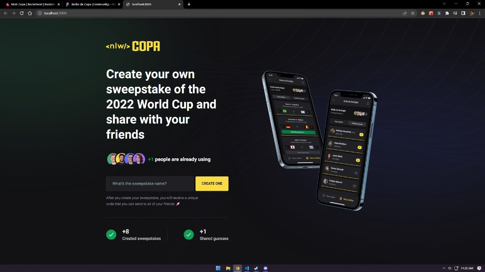

# World Cup SweepStake APP ⚽⚽


> This project was developed in the 2022 RocketSeat Next Level Week featuring the 2022 World Cup.

<br>

This app is a sweepstake app, like a beting app but using the sweepstake as the base. Users can create a pool (as it's called) and then receive a code, this code can be used to invite other players to the pool. Then, every one can make a guess of the result of the registered games.

<br>

This app is heavily focused on mobile usage, using React Native alongiste Expo, you have a lot of features like:
- Account creation with Google OAuth2
- Pool creation and sharing code
- Accepting invites and findind pools via ID
- Guessing on your pools and other friend's pools.

Desktop is really not the focus of this app, but it has it's features on desktop aswell. Developed with NEXT JS, responsive up to 320px, you can use the desktop part to create a pool, then receive a code to join via mobile and start using normally.



## ✨ Fixed and upgrades

This project is fully developed and properly working but it could have some changes:

- [x] Authentication via Google OAUTH2
- [x] Expo and React Native best practices
- [x] Awesome design
- [x] Publishing to the application stores
- [ ] Fully functional desktop website
- [ ] Group ranking area
- [ ] Payment of the winner via the app

## 💻 Prerequisites

Before going on, make sure you have the most recent versions of the following packages:

- NodeJS
- NPM
- Expo

## 🚀 Installing </>

Installing it it's quite simple, but you have to configure, the whole project. Let me explain:
<br>
This project is mono-repo divided in 3 parts, website (responsive up to 320px), mobile app using react native and expo, and a back-end serve using NodeJS.
<br>
For every division you need to install it's dependencies.

### Server
> The server must be running at all times.
```
cd /server/
npm install
npm run dev
```

### Web
> Next JS
```
cd /web/
npm install
npm run dev
```

### Mobile
> Here comes the complicated part, in order to use-it, you must have expo installed and fully configured in your PC, and if you don't have a mobile phone, you must use an emulation app. You can check out expo config setup here [https://docs.expo.dev/](https://docs.expo.dev/)
```
cd /web/
npm install
npx expo start
```

### Configuration
> Remember to have the server running.

To use the mobile login, you must have a google OAUTH2 key, once you get that, you must create a .env file in the mobile root folder. Check out .env.example to correct setup the variable.

You can check how to get a google auth code here [https://developers.google.com/identity/protocols/oauth2](https://developers.google.com/identity/protocols/oauth2)

<sup>maybe, just maybe i did forget to delete my key from the previous commits 🤫</sup>

## ☕ Usage </>

Using expo, login, create a pool, and invite your friends!!
<s><sup>if you have any</sup></s>

## 💡 Technologies

This project was developed using severous technologies to help organize, maintain and develop it.
Using the best practices and the market standard technologies, this project uses:
- ReactJS
- NextJS
- React Native
- Tailwind CSS
- PostCSS
- TypeScript
- Node JS
- Prisma ORM
- SQLite3
- Expo
- Fastify
- EsLint